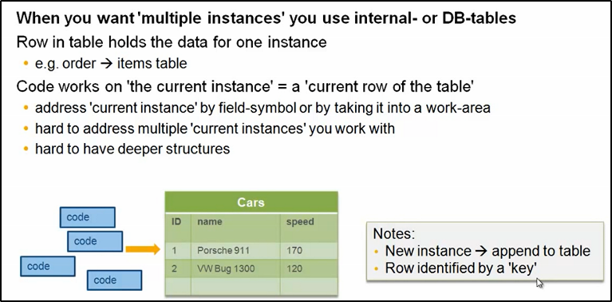
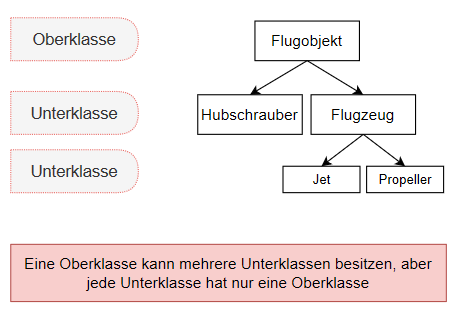

# ABAP OO
---

[Zurück zur Startseite](https://wolfgangzeller.github.io/ABAP-for-SAP-BW/)

## Theorie

### Begriffsbestimmung
**Klasse:** Bauplan der Objekte

**Objekt:** Objekte sind Instanzen von Klassen. Jedes Objekt hat eine eindeutige Identität und eigene Attribute.

**Objektreferenzen:** Der Zugriff innerhalb eines ABAP-Programms auf ein Objekt erfolgt ausschließlich über dessen Objektreferenz (= Zeiger auf Objekte)

**Instanz:** Ein Exemplar eines Objekts



**Vererbung:** Objekte können auf mehrere Klassen aufgeteilt werden (Vererbung auf Ober-/Unterklassen, MVC-Prinzip). Klasse darf nicht FINAL sein. Methoden und Attribute werden nur vererbt, wenn für sie entsprechende Sichtbarkeitsbereiche definiert wurden.



**Selbstreferenz me->:** In einer Methode können mit der Selbstreferenz andere Instanzmethoden (sollten *private* sein) derselben Klasse aufgerufen werden. `me->method_name( ).`

| **Sichtbarkeitsbereich:** | Eigenschaft |
| :--- | :--- |
| public | alle Komponenten sind aus allen Programmen und Klassen aufrufbar und sichtbar |
| private | Komponenten sind nur innerhalb der eigenen Klasse aufrufbar und sichtbar |
| protected | Komponenten sind nur innerhalb der eigenen Klasse und in der Hierarchie nach unten aufrufbar und sichtbar |

**Instanz vs. statisch**: Instanzmethoden erst verwendbar, nachdem ein Objekt instanziiert wurde. Statische Methoden sind jederzeit verwendbar, existiert nur einmal für die Klasse und wird verwendet, wenn alle Objekte auf den gleichen Wert zugreifen müssen.

**Variable:** Sollten immer *private* oder *public-read-only* (schreibgeschützt) sein

**Konstante:** Können *private*, *public* und *protected* sein

| **Parameter:** | Art | Referenz- oder Wertübergabe¹ |
| :--- | :--- | :--- |
| IMPORT | Eingabe | Referenz und Wert |
| EXPORT | Ausgabe | Referenz und Wert|
| CHANGING | Ein-/Ausgabe | Referenz und Wert |
| RETURNING² | Rückgabe | Referenz und Wert |

*¹ bei Werteübergabe muss der Zusatz `VALUE()` bei der Definition angegeben werden*

*² eine Methode kann nur einen RETURNING-Parameter besitzen - zusätzliche Parameter sind nicht möglich*

**CONSTRUCTOR und CLASS_CONSTRUCTOR:** Ein *CONSTRUCTOR* ist eine Instanzmethode, die bei der Erzeugung eines Objekts der Klasse genau einmal (für dieses Objekt) automatisch ausgeführt wird. Bei mehreren Objekten einer Klasse werden deshalb auch mehrmalig der CONSTRUCTOR aufgerufen (jeweils einmal für jedes Objekt). Füllt erstmalig die Attribute des Objekts/der Instanz. Ein CONSTRUCTOR kann nur Import-Parameter besitzen und Ausnahmen erzeugen.
Ein *CLASS_CONSTRUCTOR* ist eine statische Methode und dazu gedacht, die Attribute der Klasse in einen Anfangszustand (Initialisierung) zu setzen. Er hat keine Parameter und kann keine Ausnahmen erzeugen. Konstruktoren-Methoden müssen nicht wie die anderen Methoden aufgerufen werden, sondern sie werden automatisch aufgerufen.

**Interface:** Statt einer Klasse wird ein Interface dann angelegt, wenn mehrere *public*-Komponenten von mehreren Klassen aufgerufen werden sollen. Das Interface beinhaltet keine *privat*- oder *protected*-Komponenten. Interface-Methoden beinhalten keinen Code. Der Aufruf einer Interface-Methode und einer Klassen-Methode unterscheidet sich nicht.


## Praxis
### Instanzmehtoden und statische Methoden aufrufen

### Mit Objektreferenzen arbeiten
Vor ABAP-Release 7.4
```abap
"-- Objektreferenzvariable zur Klasse erstellen
DATA object_ref TYPE REF TO class.

"-- Objektinstanz mit Parameterübergabe an Constructor erstellen
CREATE OBJECT object_ref
  EXPORTING
    i_par1 = 'AA'
    i_par2 = '1000'.
```
Ab ABAP-Release 7.4
```abap
"-- Objektreferenzvariable zur Klasse erstellen
DATA object_ref TYPE REF TO class.

"-- Objektinstanz mit Parameterübergabe an Constructor erstellen
object_ref = NEW #( i_par1 = 'AA' i_par2 = '1000' ).
```
oder mit Inline-Deklaration
```abap
DATA(object_ref) = NEW class( i_par1 = 'AA' i_par2 = '1000' ).
```
