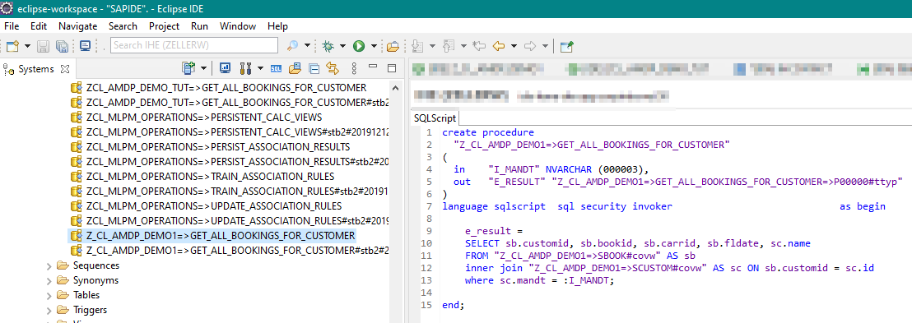

# AMDP
---

[Zurück zur Startseite](https://wolfgangzeller.github.io/ABAP-for-SAP-BW/)

## Theorie

> AMDP allows you to optimize your ABAP code (for ABAP on SAP HANA) by calling HANA database procedures from a global ABAP class.

> Der Einsatz von AMDP ist nicht sinnvoll, solange die gleiche Aufgabe auch mit Open SQL (oder ABAP CDS) erledigt werden kann. AMDP sollte nur dann verwendet werden, wenn dadurch auf datenbankspezifische Funktionen zugegriffen werden kann, die es in Open SQL nicht gibt (z.B. Währungskonvertierung).

**ABAP Managed Database Procedure** (AMDP) ist ein Framework für die Verwaltung und Aufruf von Datenbankprozeduren und -funktionen auf dem ABAP-Applikationsserver.
Diese Datenbankartefakte werden als AMDP-Prozedurimplementierung und AMDP-Funktionsimplementierung in einer AMDP-Methode innerhalb einer AMDP-Klasse implementiert.
Für die Implementierungs-Logik wird **SQLScript** verwendet. Ein Datenbank-Benutzer wird nicht benötigt. Lediglich der ABAP-Applikationsserver muss über Berechtigungen verfügen, um auf der Datenbank Artefakte verwalten zu dürfen.

Vor der ersten Verwendung legt die ABAP-Laufzeitumgebung die AMDP-Implementierungsartefakte auf der Datenbank an. AMDP-Prozeduren können keine RETURNING-Parameter besitzen - AMDP-Funktionen schon *(Anm.: RETURNING-Parameter wird nicht wirklich benötigt, da man Werte auch mit dem EXPORTING-Parameter zurückgeben kann)*.

Im Gegensatz zu einer normalen OO-Klasse müssen bei einer AMDP-Klasse zwei Code-Bausteine eingefügt werden:
Das Interface `IF_AMDP_MARKER_HDB` für die HANA-Datenbank muss angegeben werden. Und bei der Methoden-Implementierung muss `BY DATABASE PROCEDURE(|FUNCTION) FOR HDB LANGUAGE SQLSCRIPT (|READ-ONLY)` angegeben werden.

## Praxis
### AMDP-Klasse im ADT anlegen

Automatisch generierte Prozedur auf der Datenbank:

### AMDP-Klasse in ABAP Programm aufrufen

### Quellen
[AMDP - READ-ONLY](https://help.sap.com/doc/abapdocu_752_index_htm/7.52/de-de/abapmethods_amdp_options.htm#!ABAP_ADDITION_1@1@)

[AMDP - ABAP Managed Database Procedures](https://help.sap.com/doc/abapdocu_752_index_htm/7.52/de-de/abenamdp.htm)

[AMDP - Vererbung](https://help.sap.com/doc/abapdocu_752_index_htm/7.52/de-de/abenamdp_inheritance.htm)

[AMDP - Beispiele](https://help.sap.com/doc/abapdocu_752_index_htm/7.52/de-de/abenamdp_abexas.htm)
