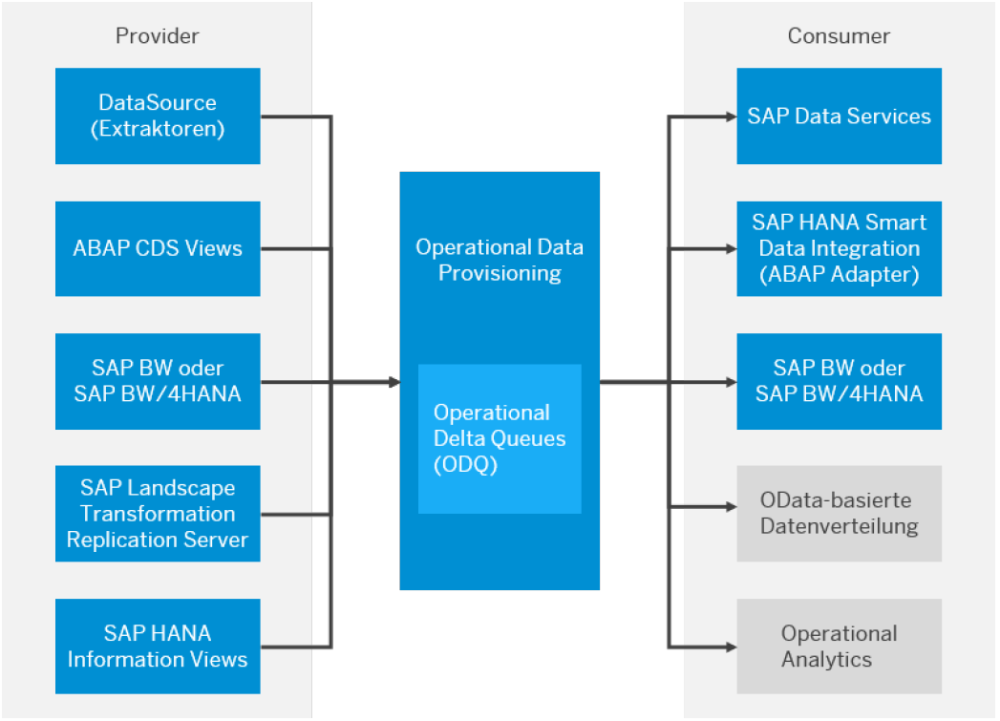
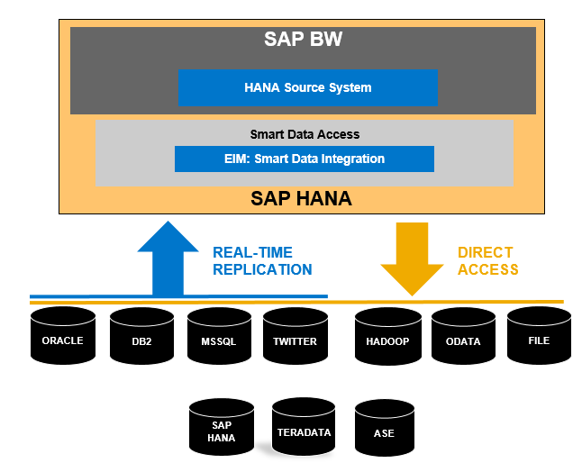

# BW/4HANA - Datenbeschaffung
---

[Zurück zur Startseite](https://wolfgangzeller.github.io/ABAP-for-SAP-BW/)

Im SAP BW/4HANA  2.0 SPS01 stehen folgende Typen von Quellsystemen zur Verfügung:
1. ODP-Quellsysteme
2. SAP-HANA-Quellsysteme
3. Big-Data-Quellsysteme
4. Flache Dateien

Weitere Informationen zur Datenbeschaffung im [SAP Application Help](https://help.sap.com/viewer/product/SAP_BW4HANA/2.0.6/en-US).

## 1. ODP-Quellsysteme
Das ODP-Framework (*Operational Data Provisioning*) stellt einen "Vermittler" zwischen Nicht-HANA-Quellsystemen und dem BW/4HANA-System dar. Als persistente Datenablage nutzt das ODP-Framework die ODQ (*Operational Data Queue*). Die Quellsysteme werden dabei Provider (Anbieter) und die Zielsysteme als Subscriber (Abonnoment) bezeichnet.

Neben der Entkoppelung zwischen Quell- und Zielsystem bringt ODP noch einige interessante Funktionen mit:
- einmalige Extraktion der Quelldaten bei mehrfacher Verteilung an unterschiedliche Zielsystem ("extract once, deploy many")
- die ODQ vereinheitlicht den Datenaustausch, die Konfiguration und das Monitoring und bietet die Funktion der separat, konfigurierbaren Aufbewahrungsfristen der Quelldaten (Data Retention)
- PSA und InfoPackages werden teilweise obsolet, weil per DTP direkt von der ODQ in die InfoProvider geladen werden kann

Quelldaten können mithilfe des ODP-Frameworks entweder physisch von der DataSource in einen BW-InfoProvider geladen werden oder Sie können die DataSource, wenn sie Direktzugriff unterstützt, als Quelle in einem Open ODS View verwenden.

## 2. SAP-HANA-Quellsysteme
Das SAP HANA-Quellsystem stellt den zentralen und einheitlichen Zugriff auf Quellen zur Verfügung, die über SAP HANA SDI (*Smart Data Integration*) oder SAP HANA SDA (*Smart Data Access*) bereitgestellt werden.

Sie können über Open ODS Views und CompositeProvider virtuell auf die Daten zugreifen. Für alle Quellen ist die Datenübertragung im Full-Modus unterstützt und, sofern die Quelle dies unterstützt, generisches Delta.
Für viele Data-Provisioning-Adapter ist mit dem SAP HANA-Quellsystem Real-Time-Replikation unterstützt.

### SDI (Smart Data Integration)
SDI stellt drei Optionen zur Verfügung, externe Daten aus unterschiedlichen Quellen in das BW zu integrieren:
- Daten-Virtualisierung
- Datenreplikation im klassischen Batch-Modus
- Datenreplikation in Echtzeit

Bei der Daten-Virtualisierung werden die Daten nicht physisch auf die HANA-Datenbank geladen, sondern repräsentiert nur eine Sicht auf die Daten, die zur Laufzeit einer BW-Query aus dem Quellsytem angefordert werden. Bei der Datenreplikation im Batch-Modus werden Quelldaten ganz typisch in einem BW-InfoProvider abgelegt. Bei der Datenreplikation in Echtzeit werden die Quelldaten in eine INSERT- bzw. UPSERT-Tabelle auf der HANA-Datenbank abgelegt. Von dort können die Daten mit einer Streaming-Prozesskette in ein aDSO geschrieben werden oder es erfolgt ein direkter Zugriff mit einem Open ODS View.

### SDA (Smart Data Access)
Im Gegensatz zu SDI lassen sich Quelldaten mit SDA nur über einen virtuellen Zeiger (Daten-Virtualisierung) für BW-Szenarien nutzbar machen.

## 3. Big-Data-Quellsysteme
Über SAP HANA Smart Data Access lässt sich unter Verwendung des SAP HANA Spark Controllers und des Adapters SPARK SQL oder unter Verwendung des Adapters VORA der Zugriff auf Hadoop-Quellen ermöglichen.

Durch beide Adapter können Sie über Open ODS View und CompositeProvider virtuell auf die Daten eines Big-Data-Quellsystems zugreifen.

## 4. Flache Dateien
Die Daten der flachen Datei können von einer Workstation oder von einem Applikationsserver ins SAP BW∕4HANA übertragen werden.
