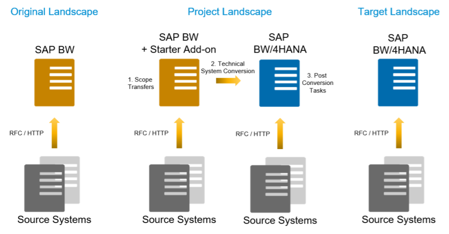
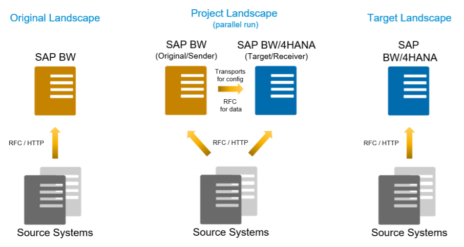

# BW/4HANA - Migration
---

[Zurück zur Startseite](https://wolfgangzeller.github.io/ABAP-for-SAP-BW/)

Es stehen 4 Methoden zur Verfügung, um ein SAP BW/4HANA einzuführen bzw. zu migrieren
1. In-place Conversion
2. Remote Conversion
3. Shell Conversion
4. Greenfield-Ansatz (komplette Neueinführung des Systems)

SAP bietet zu allen 4 Methoden umfassende Informationen in ihrer [Simplification List](https://help.sap.com/doc/590752e646cc4b15a9092f32353b209a/1.0/en-US/SAP_BW4HANA_10_Simplification_List.pdf) und in ihrem [Conversion Guide](https://help.sap.com/doc/c3f4454877614bc7b9e85ae1f9d1d2c7/1.0/en-US/SAP_BW4HANA_10_Conversion_Guide.pdf).

## 1. In-place Conversion
- Komplette Systemmigration eines bestehenden SAP BW-Systems (SID wird beibehalten)
- Schritt für Schritt Konvertierung von klassischen BW-Objekten zu HANA-optimierten Objekten
- nach der Schritt für Schritt Konvertierung erfolgt die Migration auf SAP BW/4HANA
- kein Parallelbetrieb
- Voraussetzung: SAP BW 7.5 SP5 powered by SAP HANA

## 2. Remote Conversion
- startet mit der Installation eines SAP BW/4HANA-Systems im Greenfield-Ansatz (neue SID)
- einzelne Datenflüße werden für die Migration ausgewählt und auf das BW/4HANA-System gespeichert
- anschließend erfolgt die Datenmigration dieser Datenflüße
- Parallelbetrieb bei jedoch geringem Risko eines Datenverlusts
- Voraussetzung: minimum SAP BW 7.3 on any Database

## 3. Shell Conversion
- ähnelt der Remote Conversion, allerdings ohne die Datenmigration (neue SID)
- ist im Grunde ein beschleunigter Greenfield-Ansatz, da Datenflüße nicht neu erstellt werden müssen, sondern bestehende migriert werden
- Parallelbetrieb
- Voraussetzung: minimum SAP BW 7.0 on any Database

## 4. Greenfield-Ansatz
- dieser Ansatz wird bei SAP Neukunden verwendet (neue SID)
