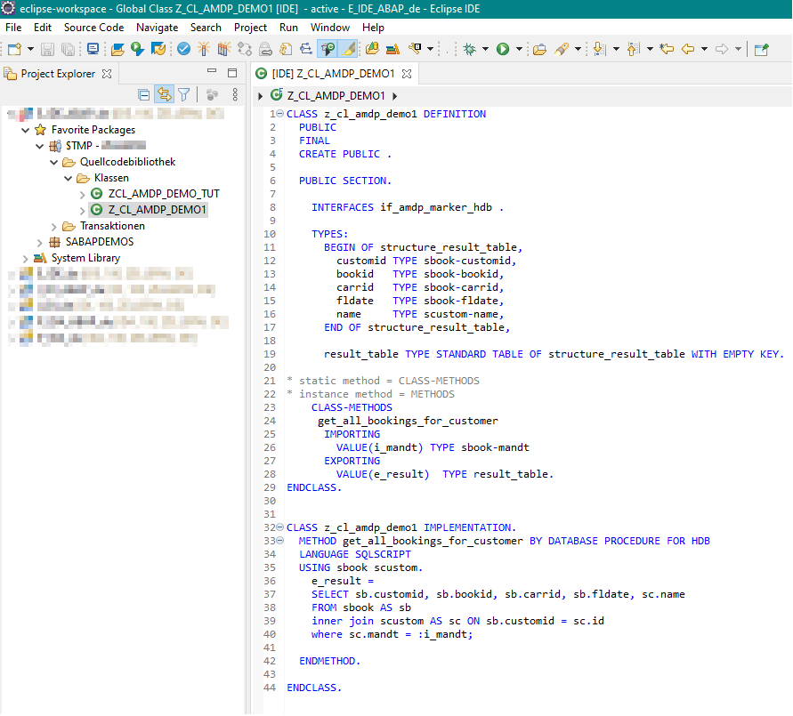
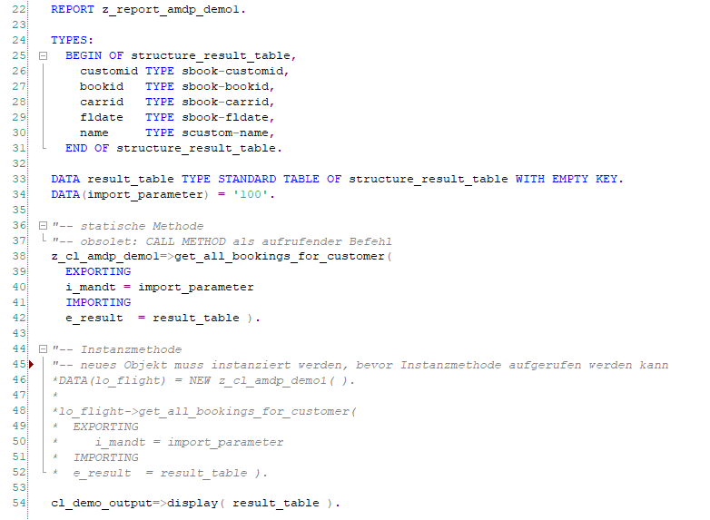

# Anlegen einer AMDP-Klasse
---

[Zurück zur Startseite](https://wolfgangzeller.github.io/ABAP-for-SAP-BW/)

## AMDP-Klasse im ADT anlegen

## AMDP-Klasse in ABAP Programm aufrufen

*Nächste Schritte:*
LINK(Anzeigen des Ergebnisses einer OO-Klasse im ADT)
