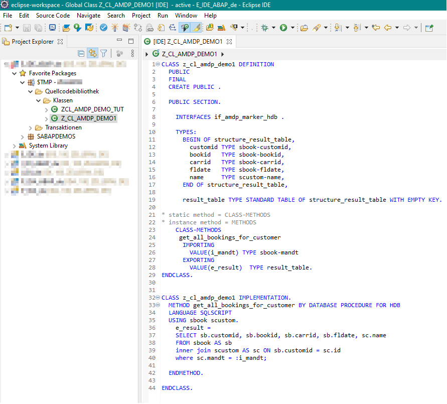

# Anlegen einer AMDP-Klasse
---

[Zurück zur Startseite](https://wolfgangzeller.github.io/ABAP-for-SAP-BW/)

## Schritt 1 - Neue ABAP Class im ADT anlegen
Rechtsklick auf entsprechendes *ABAP Packages->New->ABAP Class*

## Schritt 2 - Definition der Klasse

## Hinweise
- wird die AMDP-Methode später in einem ABAP Programm aufgerufen, muss in der **Definition** (Schritt 2) die AMDP-Methode als statische Methode mit `CLASS-METHOD` angegeben werden. Für die Verwendung als Instanz-Methode reicht die Anweisung `METHODS`.

*Nächste Schritte:*
LINK(Aufruf einer AMDP-Klasse aus ABAP Programm)
LINK(Anzeigen des Ergebnisses einer OO-Klasse im ADT)
