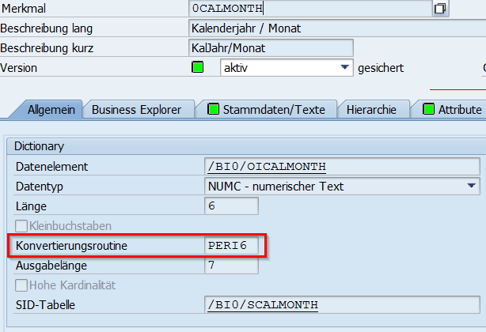

# Konvertierungsroutine PERI6 - 0CALMONTH
---

[Zurück zur Startseite](https://wolfgangzeller.github.io/ABAP-for-SAP-BW/)

Das Merkmal 0CALMONTH besitzt standardmäßig die Konvertierungsroutine PERI6. Diese Konvertierungsroutine wird für sechsstellige Geschäftsjahres-Perioden verwendet.
Die Konvertierungsroutine setzt ein externes Format wie MM.YYYY in das interne Format YYYYMM um.


Da das SAP System ein externes Format wie DD.MM.YYYY in das interne Format YYYYMMDD umwandelt, können unabhängig von der Konvertierungsroutine PERI6 auch folgende Codezeilen für die Extraktion von CALMONTH aus einem Datum verwendet werden:
```abap
"-- externes Datumsformat 31.12.1999
lv_internes_format = '19991231'.

lv_calmonth = lv_internes_format(6).

"-- Output: '199912'
  ```
    
 [SAP Help - Konvertierungsroutine PERI6](https://help.sap.com/saphelp_tm80/helpdata/de/d9/eba18b899e42428c9e922f77a8aec0/content.htm?no_cache=true)

Weitere Konvertierungsroutinenen: [SAP Help - Konvertierungsroutinen im BW-System](https://help.sap.com/doc/saphelp_tm92/9.2/de-DE/4a/547e776a8a1cd4e10000000a421937/frameset.htm)
