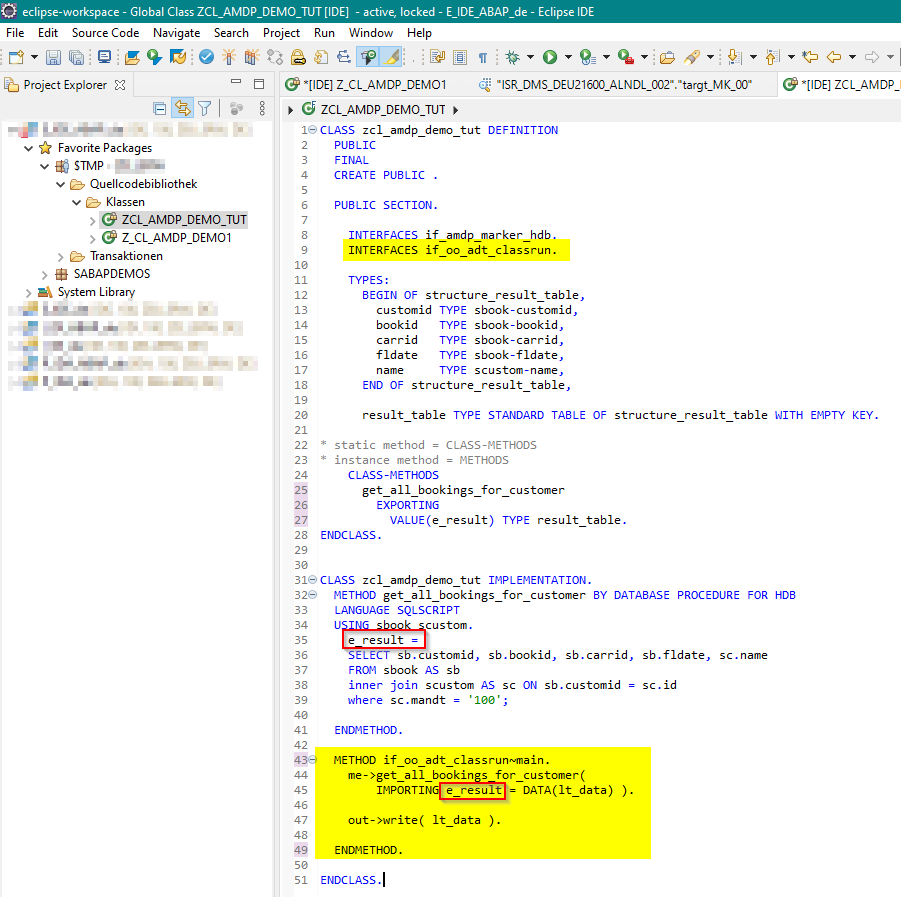

# Ergebnis einer OO-Methode direkt in der ADT-Konsole anzeigen
---

[Zurück zur Startseite](https://wolfgangzeller.github.io/ABAP-for-SAP-BW/)

[Launching an ABAP Application (Console) - ABAP Developer User Guide](https://help.sap.com/viewer/c238d694b825421f940829321ffa326a/1610%20003/en-US/520a4e84024b4a96b3793775bf9e6844.html)

