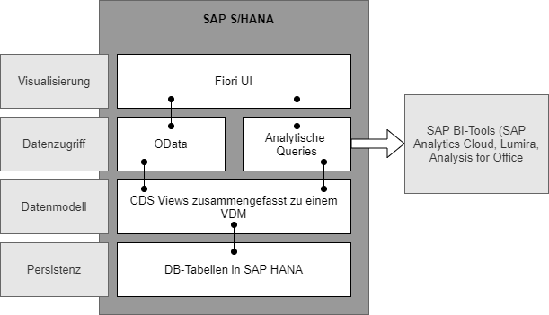

# S/4HANA Embedded Analytics
---

[Zurück zur Startseite](https://wolfgangzeller.github.io/ABAP-for-SAP-BW/)

Der Begriff *Analytics* beschreibt den Prozess der Sammlung, Strukturierung und Visualisierung von Daten, um damit zuerst einen Zusammenhang (Insights) und Erkenntnisse aus ihnen zu gewinnen, die dann zu konkreten Entscheidungen und Handlungen führen.

Verschiedene Tabellen werden in ABAP CDS Views zu einem betriebswirtschaftlichen und semantischen Datenmodell (VDM) virtuell über Joins und Assoziationen kombiniert und zusammengefasst. Anschließend wird dieses virtuelle Datenmodell über das offen Datenprotokoll OData servicefähig gemacht, um mit den SAP Fiori UIs in analytischen Anwendungen konsumierbar zu werden.

Über die Analytic Engine des S/4HANA-Systems werden die CDS Views für die verschiedenen SAP BI-Tools (SAP Analytics Cloud, Lumira, Analysis for Office etc.) nutzbar gemacht.

