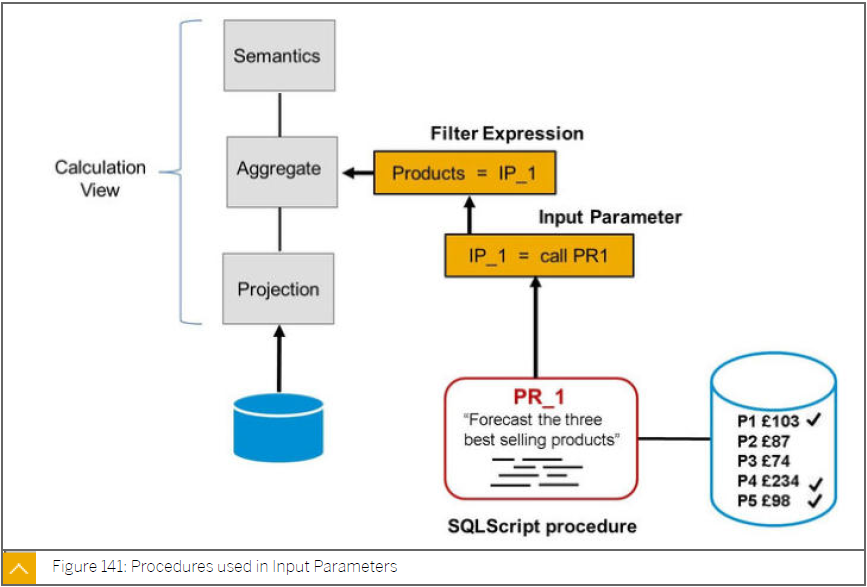

# SAP HANA - Prozeduren
---

[Zurück zur Startseite](https://wolfgangzeller.github.io/ABAP-for-SAP-BW/)

### Eigenschaften einer Prozedure
- Input-Parameter: multiple (primitive SQL-Typen, Tabellentypen)
- Output-Parameter multiple (Skalar, Tabellentypen)
- Aufruf der Funktion im *SELECT* Statement als *FROM* Klausel
- Read-only
  - DDL oder DML Statements wie *INSERT*, *UPDATE*, *ALTER*, *MODIFY*, *APPEND* oder *DELETE* sind nicht möglich
  - nur andere Read-only Funktionen können innerhalb der Funktion aufgerufen werden

### Basic Syntax einer Prozedure
Wie man eine Prozedur erstellt, wird im folgenden Beispiel gezeigt
```sql
 CREATE PROCEDURE procedure_name (
    IN im_par1  VARCHAR(1000);
    IN im_par2  VARCHAR(1),
    OUT ex_par1 TABLE (column1 INT, 
                       column2 INT)
 LANGUAGE SQLSCRIPT
 READS SQL DATA
 AS BEGIN
  ex_par1 = SELECT PNr, Name FROM :lt_itab;
 END; 
 ```
Die Anweisung `READS SQL DATA` wird verwendet, wenn die Prozedure ausschließlich DQI Statements wie *SELECT* verwendet. Werden DDL Statements wie *APPEND*, *UPDATE etc verwendet, muss die READS SQL DATA Answeisung weggelassen werden.

Wie man eine Prozedure aufruft, wird im folgenden Beispiel gezeigt
```sql
CALL procedure_name( im_par1=>'Dies ist ein Test-String', im_par2=>lv_var1, ex_par1=>lt_itab2) 
```

### Use Case einer Prozedure


### Link zum SAP Help Portal
[SAP Help Portal | SAP HANA SQLScript Reference | 2.0 SPS 03 | User-Defined Function](https://help.sap.com/viewer/de2486ee947e43e684d39702027f8a94/2.0.03/en-US/765815cd7d214ed38c190dc2f570fe39.html)
