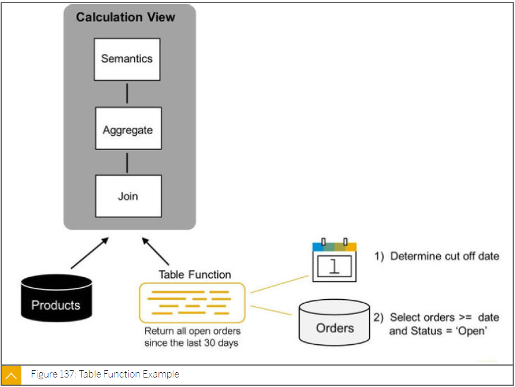

# SAP HANA - Tabellenfunktionen
---

[Zurück zur Startseite](https://wolfgangzeller.github.io/ABAP-for-SAP-BW/)

### Eigenschaften einer Tabellenfunktion
- Input-Parameter: einen oder mehrere Primitive SQL-Typen oder Tabellentypen
- Output-Parameter ist genau eine Tabelle
- Aufruf der Funktion im *SELECT* Statement als *FROM* Klausel
- Read-only
  - DDL oder DML Statements wie *INSERT*, *UPDATE*, *ALTER*, *MODIFY*, *APPEND* oder *DELETE* sind nicht möglich
  - nur andere Read-only Funktionen können innerhalb der Funktion aufgerufen werden

### Basic Syntax einer Tabellenfunktion
Wie man eine einfache Tabellenfunktionen erstellt, wird im folgenden Beispiel gezeigt
```sql
 CREATE FUNCTION func_name (im_par INT)
 RETURNS TABLE (column1 INT, column2 INT) 
 LANGUAGE SQLSCRIPT 
 AS BEGIN
    RETURN SELECT a, :im_par * b AS b FROM db_table;
 END;
```

Wie man eine Tabellenfunktion aufruft, wird im folgenden Beispiel gezeigt
```sql
SELECT * FROM func_name(10);
```

### Use Case einer Tabellenfunktion


### Link zum SAP Help Portal
[SAP Help Portal | SAP HANA SQLScript Reference | 2.0 SPS 03 | User-Defined Function](https://help.sap.com/viewer/de2486ee947e43e684d39702027f8a94/2.0.03/en-US/765815cd7d214ed38c190dc2f570fe39.html)
