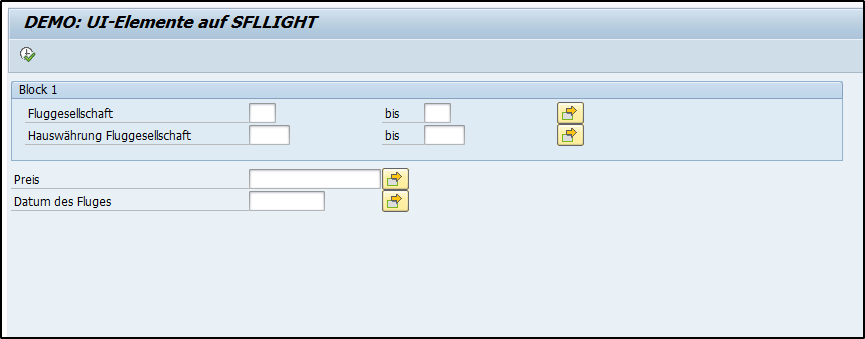

# SELECTION-SCREEN
---
[Zurück zur Startseite](https://wolfgangzeller.github.io/ABAP-for-SAP-BW/)

## Basis-Syntax
```abap
SELECTION-SCREEN BEGIN OF BLOCK nama_of_block [WITH FRAME [TITLE TEXT-xxx]].
...
SELECTION-SCREEN END OF BLOCK name_of_block.
```
Diese Anweisung generiert einen Block auf dem aktuellen Selektionsbild. Der Name des Blocks darf maximal 20 Zeichen lang sein. Innerhalb eines Blocks können weitere Blöcke angelegt werden (nested blocks).

## Syntax-Erweiterungen
... `WITH FRAME [TITLE TEXT-xxx]`

Die Erweiterung `WITH FRAME` zeichnet einen Rahmen um den Block. Mit der zusätzlichen Erweiterung `TITLE TEXT-xxx` kann ein Titel für den Block vergeben werden. Über die Funktion *Textelemente* kann im Reiter *Textsymbole* eine Text-Nummer `xxx` vergeben werden, die den Block-Titel definiert. Im Reiter *Selektionstexte* die Bezeichnungen der Block-Variablen definiert werden.
Die Funktion *Textelemente* kann in der SAP GUI im Hauptmenü *Springen->Textelemente* und im ADT über das Kontextmenü *Open Others->Text Elements* aufgerufen werden.

... `NO_INTERVALS`

Per Default werden für die Selektionskriterien eines Blocks "von-bis"-Eingabefelder angezeigt. Mit der Erweiterung `NO_INTERVALS` werden für alle Selektionskriterien innerhalb des Blocks ein einziges Eingabefeld angezeigt.

## Beispiel

```abap
REPORT z_report_ui_demo1.

TABLES sflight.

"-- Block 1 mit Rahmen, Titel und "von-bis"-Eingabefelder
SELECTION-SCREEN BEGIN OF BLOCK block_1 WITH FRAME TITLE TEXT-001.
SELECT-OPTIONS:
s_carrid FOR sflight-carrid,
s_curr FOR sflight-currency.
SELECTION-SCREEN END OF BLOCK block_1.

"-- Block 2 ohne Rahmen und mit einfachen Eingabefeldern (NO_INTERVALS)
SELECTION-SCREEN BEGIN OF BLOCK block_2 NO INTERVALS.
SELECT-OPTIONS:
s_price FOR sflight-price,
s_date FOR sflight-fldate.
SELECTION-SCREEN END OF BLOCK block_2.
```
